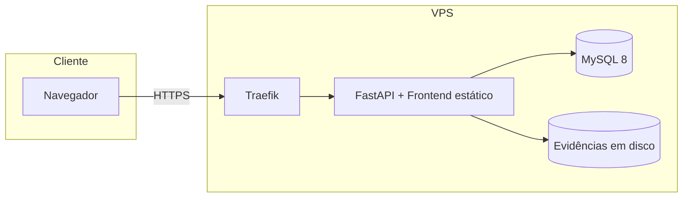

# Change Tracker

> Sistema full-stack para registrar, priorizar e acompanhar **itens de mudança** em projetos web — bugs, correções, melhorias e implementações — com evidências visuais, histórico de auditoria e colaboração por projeto.

[](https://www.python.org/)
[](https://fastapi.tiangolo.com/)
[](https://www.mysql.com/)
[](https://docs.docker.com/compose/)

---

## Índice

- [Sobre](#sobre)
- [Funcionalidades](#funcionalidades)
- [Demonstração](#demonstração)
- [Stack](#stack)
- [Arquitetura](#arquitetura)
- [Estrutura do repositório](#estrutura-do-repositório)
- [Pré-requisitos](#pré-requisitos)
- [Instalação local](#instalação-local)
- [Deploy com Docker](#deploy-com-docker)
- [Scripts SQL](#scripts-sql)
- [Variáveis de ambiente](#variáveis-de-ambiente)
- [API e documentação](#api-e-documentação)
- [Documentação adicional](#documentação-adicional)

---

## Sobre

O **Change Tracker** nasceu para equipes que precisam de um registro claro do que mudou (ou precisa mudar) em sites e aplicações — sem depender de planilhas ou threads perdidas no chat.

Cada **projeto** agrupa tickets compartilhados entre os membros da equipe. Um usuário pode participar de vários projetos e alternar entre eles na interface. Administradores gerenciam usuários, projetos e permissões por um painel dedicado.

O backend **FastAPI** serve a API REST e o **frontend estático** na mesma origem — uma única aplicação para desenvolvimento local e produção.

---

## Funcionalidades

| Área | O que faz |
|------|-----------|
| **Tickets** | Registro de mudanças com código legível (`CT-YYYYMMDD-NNN`), tipo, URL afetada, descrição, ação esperada, urgência, status, esforço e responsável |
| **Projetos** | Escopo compartilhado — todos os membros de um projeto veem os mesmos tickets |
| **Evidências** | Upload de screenshots por ticket (armazenadas em disco, metadados no banco) |
| **Histórico** | Auditoria automática de criação, alterações de status e conclusão |
| **Dashboard** | Métricas resumidas do projeto ativo (abertos, concluídos, por urgência) |
| **Import / Export** | Backup e restauração dos tickets em JSON |
| **Administração** | Gestão de usuários, papéis (`admin` / `user`), projetos e atribuições |
| **Autenticação** | JWT + bcrypt; área admin protegida por papel |

---

## Demonstração

Após executar `backend/sql/change_tracker.sql`, use as contas de demonstração:

| E-mail | Senha | Papel | Projeto(s) |
|--------|-------|-------|------------|
| `admin@ct.com` | `admin123` | Administrador | Todos |
| `maria@ct.com` | `demo123` | Usuária | Portal Corporativo |
| `carlos@ct.com` | `demo123` | Usuário | App Mobile SaaS |
| `ana@ct.com` | `demo123` | Usuária | Portal Corporativo + App Mobile SaaS |

O seed inclui **12 tickets** distribuídos entre dois projetos demo: *Portal Corporativo* (site) e *App Mobile SaaS* (aplicativo).

---

## Stack

| Camada | Tecnologias |
|--------|-------------|
| **Frontend** | HTML, CSS e JavaScript vanilla — sem framework, ícones SVG inline |
| **Backend** | Python 3.12, FastAPI, SQLAlchemy 2.0, Pydantic v2 |
| **Autenticação** | PyJWT, passlib/bcrypt |
| **Banco** | MySQL 8.4 |
| **Servidor** | Uvicorn (ASGI) |
| **Deploy** | Docker Compose + Traefik (HTTPS automático) |

---

## Arquitetura



**Camadas da API:** `routers` → `services` → `models` / SQLAlchemy. O schema do banco é versionado em arquivos `.sql` e aplicado manualmente — a aplicação não roda migrations automaticamente.

---

## Estrutura do repositório

```text
change_tracker/
├── frontend/                 # Interface web
│   ├── index.html            # App principal (lista, detalhe, dashboard)
│   ├── login.html            # Login e contas demo
│   ├── register.html         # Cadastro
│   ├── admin.html            # Painel administrativo
│   ├── css/
│   └── js/
├── backend/
│   ├── app/
│   │   ├── main.py           # App FastAPI + serve frontend
│   │   ├── routers/          # auth, tickets, admin, projects, …
│   │   ├── services/         # Regras de negócio
│   │   ├── models/           # ORM (User, Project, Ticket, …)
│   │   └── schemas/          # Validação Pydantic
│   ├── sql/
│   │   └── change_tracker.sql  # Schema completo (DROP + CREATE + seed demo)
│   ├── storage/evidence/     # Uploads (não versionados)
│   ├── requirements.txt
│   └── entrypoint.sh
├── Dockerfile
├── docker-compose.yml
├── .env.example
├── docs/
│   └── DESIGN_SYSTEM.md
└── README.md
```

---

## Pré-requisitos

**Desenvolvimento local**

- Python 3.12+
- MySQL 8+
- Cliente SQL (DBeaver, phpMyAdmin, etc.)

**Deploy na VPS**

- Docker e Docker Compose
- Traefik configurado na VPS
- MySQL compartilhado na rede `mysql_shared`
- Redes Docker externas `traefik` e `mysql_shared`
- Domínio com DNS apontando para o servidor

---

## Instalação local

### 1. Banco de dados

A aplicação **não cria** tabelas sozinha. Execute manualmente:

```text
backend/sql/change_tracker.sql
```

No DBeaver, phpMyAdmin ou cliente MySQL de sua preferência.

### 2. Backend e frontend

```bash
cp .env.example .env   # na raiz; edite MYSQL_HOST=127.0.0.1

cd backend
python -m venv .venv

# Windows
.venv\Scripts\activate

# Linux / macOS
source .venv/bin/activate

pip install -r requirements.txt
uvicorn app.main:app --reload
```

### 3. Acessar

| URL | Descrição |
|-----|-----------|
| http://127.0.0.1:8000/ | Aplicação principal |
| http://127.0.0.1:8000/login | Login |
| http://127.0.0.1:8000/admin | Painel admin (requer papel admin) |
| http://127.0.0.1:8000/docs | Swagger / documentação interativa da API |
| http://127.0.0.1:8000/health | Healthcheck |

---

## Deploy com Docker

Pré-requisitos na VPS: Docker, Traefik ativo, MySQL compartilhado (`mysql_shared`), redes `traefik` e `mysql_shared` criadas, e **schema SQL já aplicado** no banco do projeto.

```bash
cp .env.example .env   # DOMAIN, MYSQL_HOST=mysql_shared, senhas fortes, JWT_SECRET
docker compose up -d --build
```

| Detalhe | Valor |
|---------|-------|
| App exposta via | Traefik em `https://${DOMAIN}` e `https://www.${DOMAIN}` |
| MySQL no Docker | container compartilhado (`MYSQL_HOST`, ex.: `mysql_shared`) |
| Evidências | volume Docker `evidence_data` |

> **Importante:** após o primeiro `docker compose up`, execute `change_tracker.sql` no MySQL (via túnel SSH + DBeaver ou phpMyAdmin). O entrypoint aguarda o banco, mas não aplica o schema.

Detalhes técnicos adicionais: [`backend/README.md`](backend/README.md).

---

## Scripts SQL

| Arquivo | Quando usar |
|---------|-------------|
| `change_tracker.sql` | Instalação limpa — recria banco, tabelas e dados demo |

---

## Variáveis de ambiente

Copie `.env.example` para `.env` na raiz do projeto. **Todas as variáveis são obrigatórias** — a app falha na inicialização se alguma estiver ausente.

| Variável | Descrição |
|----------|-----------|
| `DOMAIN` | Domínio publicado via Traefik (`www.${DOMAIN}` no compose) |
| `TRAEFIK_ENTRYPOINT` | Entrypoint HTTPS (ex.: `websecure`) |
| `TRAEFIK_CERT_RESOLVER` | Cert resolver (ex.: `letsencrypt`) |
| `MYSQL_HOST` | `127.0.0.1` local · nome do container MySQL no Docker (ex.: `mysql_shared`) |
| `MYSQL_PORT` | Porta MySQL (`3306`) |
| `MYSQL_DATABASE` | Nome do banco (`change_tracker`) |
| `MYSQL_USER` / `MYSQL_PASSWORD` | Credenciais da aplicação |
| `JWT_SECRET` | Chave secreta do token (use valor longo e aleatório) |
| `JWT_ALGORITHM` | Algoritmo JWT (`HS256`) |
| `ACCESS_TOKEN_EXPIRE_MINUTES` | Validade do token em minutos |
| `STORAGE_PATH` | Pasta das evidências (`storage/evidence`) |
| `EVIDENCE_MAX_BYTES` | Tamanho máximo por imagem |
| `EVIDENCE_MAX_FILES` | Máximo de imagens por ticket |
| `APP_NAME` | Nome exibido na API |

> Nunca commite o arquivo `.env`. Use `.env.example` como referência.

---

## API e documentação

A API REST é documentada automaticamente pelo FastAPI:

- **Swagger UI:** `/docs`
- **ReDoc:** `/redoc`
- **OpenAPI JSON:** `/openapi.json`

Autenticação nas rotas protegidas:

```http
Authorization: Bearer <seu_token_jwt>
```

Principais grupos de rotas:

| Prefixo | Descrição |
|---------|-----------|
| `/auth` | Registro, login, perfil |
| `/tickets` | CRUD de tickets (escopo do projeto ativo) |
| `/projects` | Projeto ativo do usuário |
| `/admin` | Usuários, projetos e atribuições (somente admin) |
| `/dashboard` | Métricas do projeto ativo |
| `/export/json` · `/import/json` | Backup e restauração |

Lista completa de endpoints: [`backend/README.md`](backend/README.md).

---

## Documentação adicional

| Recurso | Descrição |
|---------|-----------|
| [`backend/README.md`](backend/README.md) | Referência técnica da API, banco e deploy |
| [`docs/DESIGN_SYSTEM.md`](docs/DESIGN_SYSTEM.md) | Tokens, componentes e padrões visuais |
| [`guia-backend.html`](guia-backend.html) | Guia visual das pastas do backend |

---

## Descrição sugerida para o GitHub

Cole no campo **About** do repositório:

```text
Rastreador de mudanças para equipes de desenvolvimento: tickets com evidências, projetos compartilhados, dashboard e painel admin. FastAPI, MySQL e frontend vanilla. Deploy com Docker + Traefik.
```

**Topics sugeridos:** `fastapi` `mysql` `docker` `traefik` `change-management` `ticket-system` `python` `javascript` `fullstack`
